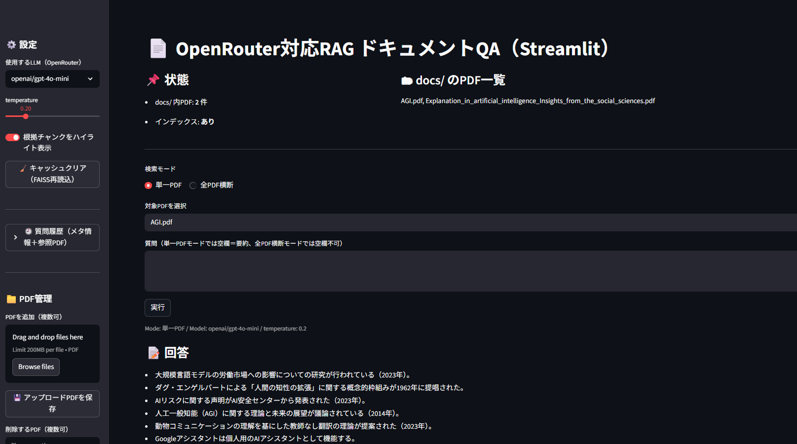

# 📄 OpenRouter対応 RAG ドキュメントQA（Streamlit）

<<<<<<< HEAD

=======

>>>>>>> 1b583fe (Update README and keep docs folder empty)

PDFドキュメントを検索・要約し、**複数のLLM（DeepSeek / Grok / GPT）を切り替えて**質問応答できる  
**RAG（Retrieval Augmented Generation）アプリケーション**です。

OpenRouter を介して複数モデルを統一的に扱い、  
FAISS + Sentence-Transformers による高速なローカル検索を組み合わせています。

---

## 🚀 Quick Start

```bash
git clone https://github.com/Cherie01234/rag-doc-qa.git
cd rag-doc-qa

python -m venv venv
venv\Scripts\activate

pip install -r requirements.txt
```

`.env` をプロジェクト直下に作成して、OpenRouter のAPIキーを設定します：

```env
OPENROUTER_API_KEY=your_api_key_here
```

インデックス作成（PDFを `docs/` に置いたあと実行）：

```bash
python ingest.py
```

アプリ起動：

```bash
python -m streamlit run app.py
```

> `streamlit` コマンドが見つからない場合でも、上の `python -m streamlit ...` なら動きます。

---

## ✨ 主な特徴

### 🔍 RAG（検索拡張生成）
- PDFをチャンク分割 → ベクトル化 → FAISS に格納  
- 質問に応じて関連チャンクを検索し、LLMに渡して回答を生成  

### 🤖 複数LLM切り替え（OpenRouter）
UIから以下のモデルを切り替え可能：

- **DeepSeek V3.2**（`deepseek/deepseek-v3.2`）
- **Grok 4.1 Fast**（`x-ai/grok-4.1-fast`）
- **GPT-4o mini**（`openai/gpt-4o-mini`）

### 📁 PDF管理
- Streamlit UI から PDF をアップロード
- 不要なPDFの削除
- ワンクリックでインデックス再構築（ingest）

### 🧭 検索モード
| モード | 内容 |
|------|------|
| 単一PDF | 選択したPDFだけを対象に質問・要約（空欄＝要約） |
| 全PDF横断 | 全てのPDFを横断して検索・質問（空欄不可） |

### 📌 出典付き回答（Explainable RAG）
- 回答の直下に **参照されたPDF名を表示**
- 根拠チャンク（参照箇所）も表示して検証可能

### 📊 PDF寄与度（全PDF横断時）
- どのPDFがどれだけ使われたか（参照チャンク数）をバーグラフで可視化

### 🖍 根拠チャンクのハイライト
- 質問に関連する語句を参照チャンク内で強調表示（ON / OFF 切替可）

### 🕘 質問履歴（メタ情報＋参照PDF）
サイドバーに以下を保存：
- 実行日時 / モード / 質問 / 選択PDF / 使用モデル / 参照PDF一覧

---

## 🛠 技術スタック

| 分類 | 使用技術 |
|------|---------|
| UI | Streamlit |
| LLM | OpenRouter（DeepSeek / Grok / GPT-4o mini） |
| ベクトルDB | FAISS |
| 埋め込み | Sentence-Transformers (`all-MiniLM-L6-v2`) |
| RAGフレームワーク | LangChain |
| PDF読み込み | PyPDFLoader |
| 設定管理 | python-dotenv |

---

## 🧩 アーキテクチャ概要

```
PDF → チャンク分割 → Embedding → FAISS
                               ↓
                         質問ベクトル
                               ↓
                    関連チャンク検索
                               ↓
                LLM（OpenRouter）で生成
                               ↓
              回答 + 出典PDF + 根拠表示
```

---

## 📂 フォルダ構成（例）

```
rag-doc-qa/
├── app.py              # Streamlit UI
├── ingest.py           # PDF → FAISS 変換
├── query.py            # CLIテスト用（任意）
├── docs/               # PDF配置（※個人情報がある場合は公開しない推奨）
├── faiss_index/        # ベクトルDB（再生成可能）
├── images/
│   └── screenshot.png  # README用スクリーンショット
├── run_app.bat
├── .env                # APIキー（絶対にコミットしない）
└── requirements.txt
```

---

## 🧠 設計のポイント
- **埋め込みモデルとLLMを分離**：検索はローカル埋め込み、生成はOpenRouter経由LLMで柔軟に切り替え
- **Explainable RAG**：回答だけでなく「どのPDFを使ったか」「どの箇所を根拠にしたか」を明示
- **運用を想定したUI**：PDF差し替え・再インデックス・モデル切替・履歴で検証しやすい

---

## ⚠️ 注意
- `.env`（APIキー）や `docs/`（個人PDF）、`faiss_index/` は公開リポジトリに含めない運用を推奨します（`.gitignore` 対応）。
- OpenRouterの利用には料金・レート制限がある場合があります。必要に応じてモデルや設定値を調整してください。
